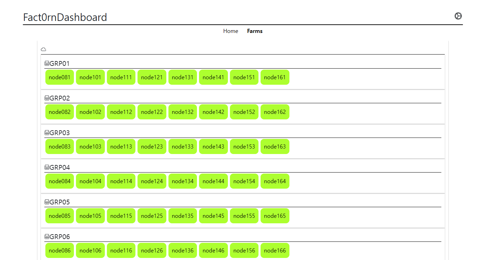
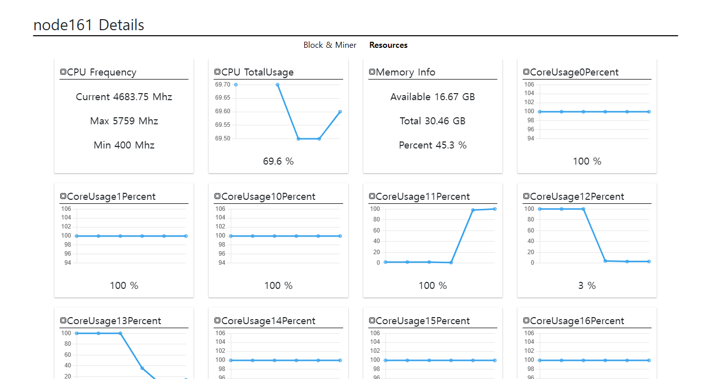

# Fact0rnDashboard 3.1






> Fact0rnDashboard server.

> Base: Ubuntu22.04

> Windows will not work (WSL may work). 

## ChangeLog

### 3.1

- Now we don't look up data every time a request comes in.
  - Pools all the information, stores the data in memory, and returns the stored data on request.

- This is still the case today, but that git doesn't record any versions other than the ChangeLog.
  - The ChangeLog is a record of my stupidity.

- We've removed, simplified, and optimized a lot of silly coding and logic.
  - That doesn't mean it's the best quality.

- We've seen smooth behavior even in places with 100+ miners.

- We created an API to delete `Farm`, `Group`, and `Nodename` from the `mine.sh` file in case the miner changes them, but we didn't publish it on the web because it's a special case.

### 3.0

- I decided not to think about server resources anymore.

- We decided to use more CPU resources by creating processors for each I/O task.

- Ditch `async` and use the multiprocessor module.

- For the API service, we changed to the `fastAPI` module.

- In 2.0, we only tested with 20 or fewer miners, and found issues with 90+ miners.

- Separated the `API` and `View` port numbers and combined them into `Port 8080`.

### 2.0

- We recreated the backend server.

   - Received data over UDP and changed the Python script from `threading` based to `async` based.
      - ※ We no longer retain data that arrives when the `DashBoardServer` is offline.
   
   - Unnecessary modules were removed, and short tasks were combined into a single task.

- It's better than the previous version, but it's also not perfect.

### 1.1

- Optimised backend failover times.

- You can add a `logs` tab to view the event logs of your nodes in real-time.

## Features

### 1. Check the status of your miners 

> You can check the status of your miners and their mining logs.

### 2. Instantly see mined blocks in graphs and numbers 

### 3. Provide API

> API are also provided to enable third-party development.

## MinerNode Setting

1. Connect the Fact0rnDashBoard server to the MinerNodes.

    ```shell
    cd $MINER_HOME/miners/fact_dist

    vi mine.sh
    ```

    > In mine.sh, make the following changes

    ```
    export MN_BROKER="fact0rn_net:9092"
    export FARM_GROUP="SAMPLE_FARM"
    export MINER_GROUP="SAMPLE_GROUP"
    ```
2. Change Domain setting
    ```shell
    sudo vi /etc/hosts
    ```
    > Append /etc/hosts
    ```
    SERVER_IP       fact0rn_net
    # example
    192.168.0.2        fact0rn_net
    ```

## Preparatory work.

> You should have the following tasks ready


1. A server PC that meets the recommended specifications.

    - RAM : 16 GB or more.
    - Storage : Minimum 200 GB, more is better.
    - CPU with 5+4+@ or more..
    
    > Use the following applications..

        0. Docker , Docker-compose
        1. OpenSearch (High RAM, Disk usage.)
        2. PythonBackendServer

2. Your public IP for external access.
    > Set the external allowed access port to 2648, 2649, 8080, 9092. (You'll also need port 9092 as needed (if your server is in a different location to the MinerNode))


## Dashboard URL

> If installed correctly, you can access the URL below.

`http://{YOUR_IP_ADDR}:8080`

- In Local.

    `http://127.0.0.1:8080`

- To take advantage of the `API`...
  
    `http://127.0.0.1:2648/docs`

## ERROR: Cannot read properties of undefined (reading 'total')

> If you started the dashboard server a few minutes ago, you might not see EventInfo and RaceWinMachines because the backend server is still collecting information.

## Setting `conf.yml`

> There is a `conf.yml` file in the `opt/Fact0rnDashboardServer3/conf.yml` directory that allows you to configure the application, the following are the default values and can be changed.

> Please restart the service after changing the settings.

> `systemctl restart fact-ds.service`

> Note: It is recommended that you do not touch anything other than `ViewServer_core` and `ProxyServerPort` if possible.

```yaml
# Log Setting
LOG_level: WARN
LOG_max_byte_size: 2147483648
LOG_file_count: 3
LOG_file_dir: "./logs/"
LOG_format: "'%(asctime)s- %(filename)s - %(name)s - %(levelname)s - %(lineno)d - %(message)s'"

# OpenSearchConnection
OS_host: "fact0rn_net"
OS_port: 9200

# Set WebServerHost
WebServer_host: "0.0.0.0"

# Set API Port
APIServer_port: 2648

# Set View Port
ViewServer_port: 2649
# Scale up and down as appropriate for high concurrency or poor server CPU specifications.
# A smaller number will consume less CPU resources, but more concurrent connections will slow down the web.
ViewServer_core: 4

# ProxyServer
# Normal users connect to the `ProxyServerPort` number.
ProxyServerPort: 8080

# Interval between retrieving workers' status information (seconds)
BackendPoolingDataTimeSec: 10

# Interval between blocks and statistics (seconds)
# Statistics is a heavy data lookup, so we recommend using the default.
BackendPoolingLargeDataTimeSec: 30

UDP_socket_host: "0.0.0.0"
UDP_socket_port: 9092

# DEV_MODE Y/N
DEV_MODE: "N"
```

## How to install

> We recommend to switch to root user to do this action sudo -i Then run this one command
> 
```shell
sudo -i

bash <(curl -s https://raw.githubusercontent.com/hbcha0916/fact0rnDashboardServerInstaller/master/install.sh)
```

